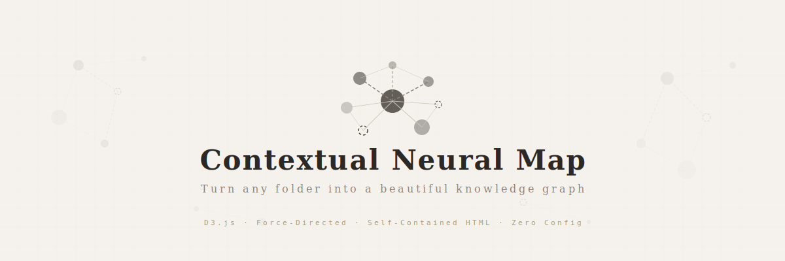
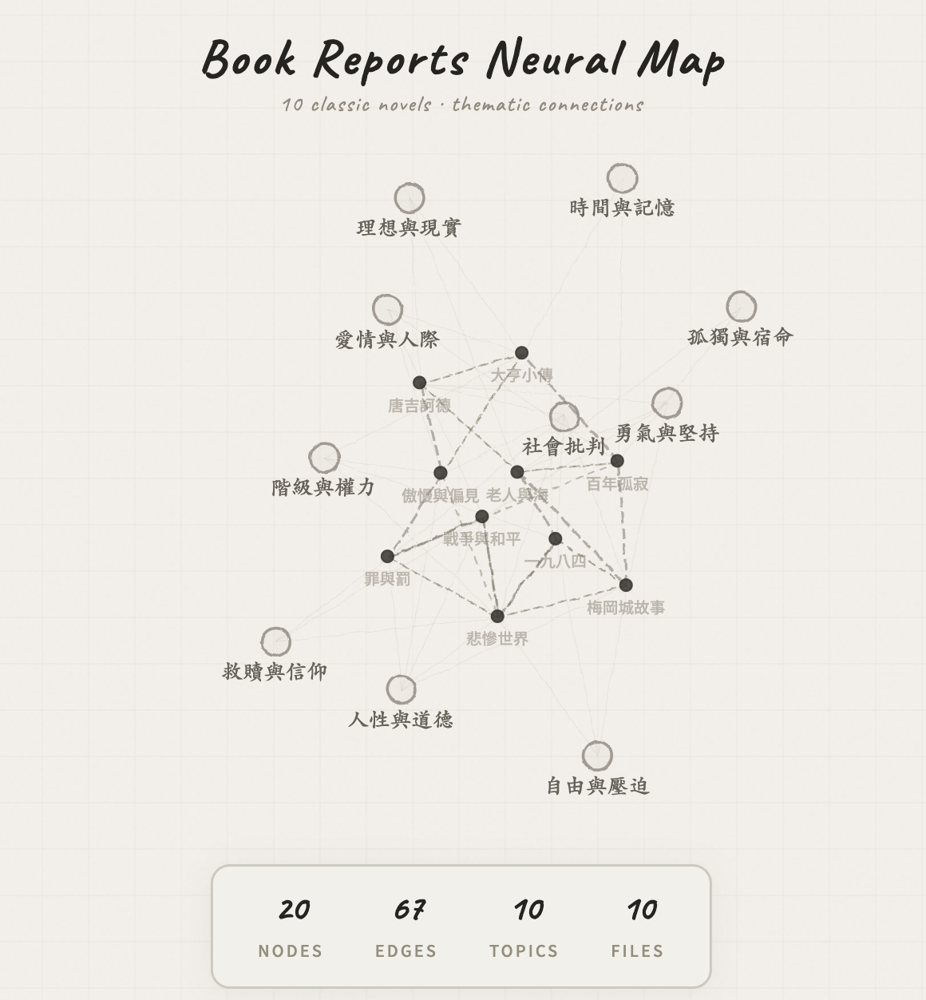

<p align="center">
  
</p>

<h1 align="center">Contextual Neural Map</h1>

<p align="center">
  <strong>把任何資料夾變成一張漂亮的互動式知識圖譜。</strong><br/>
  Obsidian 風格的力導向圖，手繪筆記本美學，D3.js 驅動。
</p>

<p align="center">
  <a href="https://0xedgelessblade.github.io/contextual-neural-map/examples/demo.html"></a>
  <a href="#-快速開始"></a>
  <a href="LICENSE"></a>
  <a href="#-運作原理"></a>
</p>

<p align="center">
  <b>🌐 <a href="#english">English</a></b>
</p>

<br/>

<p align="center">
  
</p>

<p align="center"><em>這個範例用 10 本經典文學作品，但它能吃的不只是書 —<br/>筆記、論文、專案文件、程式碼⋯⋯任何亂中有序的資料夾，都能變成一張會呼吸的圖。</em></p>

---

## 為什麼做這個

你的筆記、文件、研究散落在各個資料夾裡。你知道它們之間有關聯，但你*看不到*。

**Contextual Neural Map** 掃描任意資料夾，偵測檔案之間的關係，然後渲染成一張互動式力導向圖。產出是一個獨立的 `.html` 檔案，用任何瀏覽器直接開 — 不需要伺服器、不需要安裝、不需要設定。

它看起來就像設計師的作品集裡會出現的東西。因為本來就該這樣。

---

## ✦ 特色

**視覺設計** — 奶白色紙張背景搭配鉛筆手繪風格。奶油色調、SVG 濾鏡製造的手繪歪斜節點邊緣、Caveat 手寫字體標籤。零飽和色彩。打開它的感覺就像翻開一本 Moleskine 筆記本。

**互動體驗** — 滑鼠懸停高亮連結關係、點擊鎖定焦點、拖曳重新排列節點、滾輪縮放、搜尋框即時篩選、圖例點擊切換顯示類型。

**零依賴** — 產出是單一獨立 HTML 檔案。D3.js 從 CDN 載入。任何裝置都能開，分享給任何人。

**萬物皆可圖** — Markdown 筆記、研究論文、專案文件、課程教材、程式碼庫、寫作專案。只要資料夾裡有文字檔，就能畫成圖。

---

## ✦ 快速開始

### 方法 A：下載 Skill（推薦）

如果你用 [Claude Cowork](https://claude.ai)，下載 [`contextual-neural-map.skill`](contextual-neural-map.skill) 拖進 skills 資料夾就好。

然後直接說 **「畫關係圖」** 或 **「draw a knowledge graph」** — 剩下的它全搞定。

### 方法 B：直接用模板

1. Clone 這個 repo
2. 按照 [`SKILL.md`](SKILL.md#step-3--inject-data-into-the-html-template) 裡的 JSON 結構準備你的資料
3. 把資料注入 [`assets/template.html`](assets/template.html)（取代 `// __DATA_INJECT__` 區塊）
4. 用瀏覽器打開生成的 HTML

---

## ✦ 運作原理

```
你的資料夾                       Contextual Neural Map
┌─────────────────┐            ┌─────────────────────────────┐
│ 📄 doc-a.md     │            │  ○ Doc A                    │
│ 📄 doc-b.md     │  ──掃描──▶ │    ╲                        │
│ 📄 doc-c.md     │  ──連結──▶ │     ○ Doc B ── ○ Doc C      │
│ 📁 subfolder/   │  ──建構──▶ │    ╱    ╲                   │
│   📄 doc-d.md   │            │  ◉ 主題    ○ Doc D          │
└─────────────────┘            └─────────────────────────────┘
                                → 單一 .html 檔案輸出
```

引擎執行三個步驟：

1. **掃描** — 遞迴讀取目標資料夾中的所有檔案
2. **分析** — 從標題、標籤和重複出現的關鍵詞中提取主題。偵測交叉引用、共享主題和序列關係
3. **渲染** — 將節點/邊資料注入 D3.js 模板，輸出獨立的 HTML 檔案

---

## ✦ 節點與邊的類型

| 節點類型 | 外觀 | 說明 |
|---------|------|------|
| **文件** | ● 實心深色圓 | 主要內容檔案，大小依重要度縮放 |
| **筆記** | ○ 空心虛線圓 | 短筆記或草稿 |
| **草稿** | ◐ 半透明圓 | 進行中的檔案 |
| **標籤** | ◉ 大型標籤 | 手寫字體的主題叢集 |

| 邊類型 | 外觀 | 含義 |
|--------|------|------|
| `tag-link` | 細實線 | 節點 → 主題歸屬 |
| `content-link` | 虛線 | 共享引用或關鍵詞 |
| `sequence-link` | 粗虛線 | 序列或階層關係 |

---

## ✦ 範例展示

[`examples/`](examples/) 用 10 本經典文學當範例 — 但這只是其中一種用法。換成你的讀書筆記、工作文件、研究論文，一樣能畫。重點不是「文學」，是「關聯」。

| 檔案 | 說明 |
|------|------|
| [`demo.html`](examples/demo.html) | 生成的圖譜 — 用瀏覽器打開 |
| `01-傲慢與偏見.md` | Pride and Prejudice |
| `02-一九八四.md` | 1984 |
| `03-唐吉訶德.md` | Don Quixote |
| `04-罪與罰.md` | Crime and Punishment |
| `05-百年孤寂.md` | One Hundred Years of Solitude |
| `06-大亨小傳.md` | The Great Gatsby |
| `07-戰爭與和平.md` | War and Peace |
| `08-悲慘世界.md` | Les Misérables |
| `09-梅岡城故事.md` | To Kill a Mockingbird |
| `10-老人與海.md` | The Old Man and the Sea |

> **試試看：** 下載 [`demo.html`](examples/demo.html) 直接用瀏覽器打開。不用安裝任何東西。

---

## ✦ 自訂樣式

視覺風格完全可調。常見調整：

| 想改什麼 | 去哪改 |
|---------|-------|
| 背景色 | template 裡的 `body { background: #xxx }` |
| 節點顏色 | `nodeEls` 的 fill/stroke 值 |
| 字型 | `@import url(...)` 和 `font-family` |
| 節點大小 | `Math.sqrt(d.weight / N)` — 調 N |
| 力導向參數 | `simulation.force(...)` 的 distance/strength/charge |
| 新增邊類型 | 在 links 資料加 type + 對應的 stroke 樣式 |

---

## ✦ 專案結構

```
contextual-neural-map/
├── README.md                          # 你在這裡
├── LICENSE                            # MIT
├── SKILL.md                           # Skill 完整定義與工作流程
├── contextual-neural-map.skill        # 一鍵安裝檔（拖進 Cowork 就能用）
├── assets/
│   ├── banner.svg                     # README 頂部橫幅
│   ├── demo-screenshot.png            # 範例截圖
│   └── template.html                  # D3.js 視覺化引擎
└── examples/
    ├── demo.html                      # 生成的圖譜（用瀏覽器開）
    ├── 01-傲慢與偏見.md                 # 來源：傲慢與偏見
    ├── 02-一九八四.md                   # 來源：一九八四
    └── ...                            # 共 10 本經典文學
```

---

## ✦ 適用場景

- **個人知識庫** — 把你的 Obsidian vault、Notion 匯出、或 Zettelkasten 視覺化
- **學術研究** — 視覺化論文集，看見引用叢集
- **專案文件** — 一眼看出文件之間的關聯
- **課程教材** — 繪製先修課程和主題依賴關係
- **寫作專案** — 追蹤角色弧線、劇情線索和章節結構

---

## ✦ 授權

[MIT](LICENSE) — 隨便你怎麼用。

---

<br/>
<br/>

<h1 align="center" id="english">English</h1>

<p align="center">
  <strong>Turn any folder into a beautiful, interactive knowledge graph.</strong><br/>
  Obsidian-style force-directed visualization with a hand-drawn notebook aesthetic.
</p>

<p align="center">
  <a href="https://0xedgelessblade.github.io/contextual-neural-map/examples/demo.html"></a>
  <a href="#-quick-start"></a>
  <a href="LICENSE"></a>
  <a href="#-how-it-works"></a>
</p>

<p align="center">
  <b>🌐 <a href="#contextual-neural-map">中文</a></b>
</p>

---

## Why This Exists

You have notes, documents, research — scattered across folders. You know they're connected, but you can't *see* it.

**Contextual Neural Map** scans any folder, detects relationships between files, and renders them as an interactive force-directed graph. The result is a single `.html` file you can open in any browser — no server, no dependencies, no setup.

It looks like something out of a design portfolio. Because it should.

---

## ✦ Features

**Visual Design** — Paper-white background with pencil-sketch aesthetics. Cream tones, hand-drawn wobbly node edges via SVG filters, Caveat handwriting font for labels. Zero saturated colors. Feels like opening a Moleskine.

**Interactive** — Hover to highlight connections. Click to lock focus. Drag nodes to rearrange. Scroll to zoom. Search box filters in real-time. Legend toggles visibility by type.

**Zero Dependencies** — The output is a single self-contained HTML file. D3.js is loaded from CDN. Open it on any device, share it with anyone.

**Works With Anything** — Markdown notes, research papers, project docs, course materials, codebases, writing projects. If it's text in a folder, it can be mapped.

---

## ✦ Quick Start

### Option A: Download the Skill (Recommended)

If you use [Claude Cowork](https://claude.ai), download [`contextual-neural-map.skill`](contextual-neural-map.skill) and drop it into your skills folder.

Then just say **"map this folder"** or **"draw a knowledge graph"** — and it handles everything.

### Option B: Use the Template Directly

1. Clone this repo
2. Prepare your data as the JSON structure described in [`SKILL.md`](SKILL.md#step-3--inject-data-into-the-html-template)
3. Inject your data into [`assets/template.html`](assets/template.html) (replace the `// __DATA_INJECT__` block)
4. Open the resulting HTML in a browser

---

## ✦ How It Works

```
Your Folder                    Contextual Neural Map
┌─────────────────┐            ┌─────────────────────────────┐
│ 📄 doc-a.md     │            │  ○ Doc A                    │
│ 📄 doc-b.md     │  ──scan──▶ │    ╲                        │
│ 📄 doc-c.md     │  ──link──▶ │     ○ Doc B ── ○ Doc C      │
│ 📁 subfolder/   │  ──build─▶ │    ╱    ╲                   │
│   📄 doc-d.md   │            │  ◉ Topic    ○ Doc D         │
└─────────────────┘            └─────────────────────────────┘
                                → Single .html file output
```

1. **Scan** — Recursively reads all files in the target folder
2. **Analyze** — Extracts topics from headings, tags, and recurring keywords. Detects cross-references, shared themes, and sequential relationships
3. **Render** — Injects the node/edge data into the D3.js template and outputs a self-contained HTML file

---

## ✦ Gallery

The [`examples/`](examples/) folder uses 10 classic novels as a demo — but that's just one use case. Swap in your research papers, project docs, meeting notes, or codebase, and it maps them just the same. The point isn't "literature." It's the connections hiding in any folder.

| File | Description |
|------|-------------|
| [`demo.html`](examples/demo.html) | The generated graph — open in browser |
| `01-傲慢與偏見.md` | Pride and Prejudice |
| `02-一九八四.md` | 1984 |
| `03-唐吉訶德.md` | Don Quixote |
| `04-罪與罰.md` | Crime and Punishment |
| `05-百年孤寂.md` | One Hundred Years of Solitude |
| `06-大亨小傳.md` | The Great Gatsby |
| `07-戰爭與和平.md` | War and Peace |
| `08-悲慘世界.md` | Les Misérables |
| `09-梅岡城故事.md` | To Kill a Mockingbird |
| `10-老人與海.md` | The Old Man and the Sea |

> **Try it yourself:** Download [`demo.html`](examples/demo.html) and open it in your browser. No installation needed.

---

## ✦ Customization

| Want to change… | Where |
|-----------------|-------|
| Background color | `body { background: #xxx }` in template |
| Node colors | `nodeEls` fill/stroke values |
| Fonts | `@import url(...)` and `font-family` |
| Node sizing | `Math.sqrt(d.weight / N)` — adjust N |
| Force layout | `simulation.force(...)` distance/strength/charge |
| New edge type | Add type to links data + matching stroke style |

---

## ✦ Project Structure

```
contextual-neural-map/
├── README.md                          # You are here
├── LICENSE                            # MIT
├── SKILL.md                           # Full skill definition & workflow
├── contextual-neural-map.skill        # One-click install for Cowork
├── assets/
│   ├── banner.svg                     # README header banner
│   ├── demo-screenshot.png            # Demo screenshot
│   └── template.html                  # D3.js visualization engine
└── examples/
    ├── demo.html                      # Generated graph (open in browser)
    ├── 01-傲慢與偏見.md                 # Source: Pride and Prejudice
    ├── 02-一九八四.md                   # Source: 1984
    └── ...                            # 10 classic novels total
```

---

## ✦ Use Cases

- **Personal knowledge bases** — Map your Obsidian vault, Notion exports, or Zettelkasten
- **Research** — Visualize paper collections and see citation clusters
- **Project documentation** — See how your docs relate at a glance
- **Course materials** — Map prerequisites and topic dependencies
- **Writing projects** — Track character arcs, plot threads, and chapter structure

---

## ✦ License

[MIT](LICENSE) — Use it however you want.

---

<p align="center">
  <sub>Built with <a href="https://d3js.org">D3.js</a>. Inspired by <a href="https://obsidian.md">Obsidian</a>'s Graph View.</sub><br/>
  <sub>If this made you go "oh that's pretty" — consider giving it a ⭐</sub>
</p>
